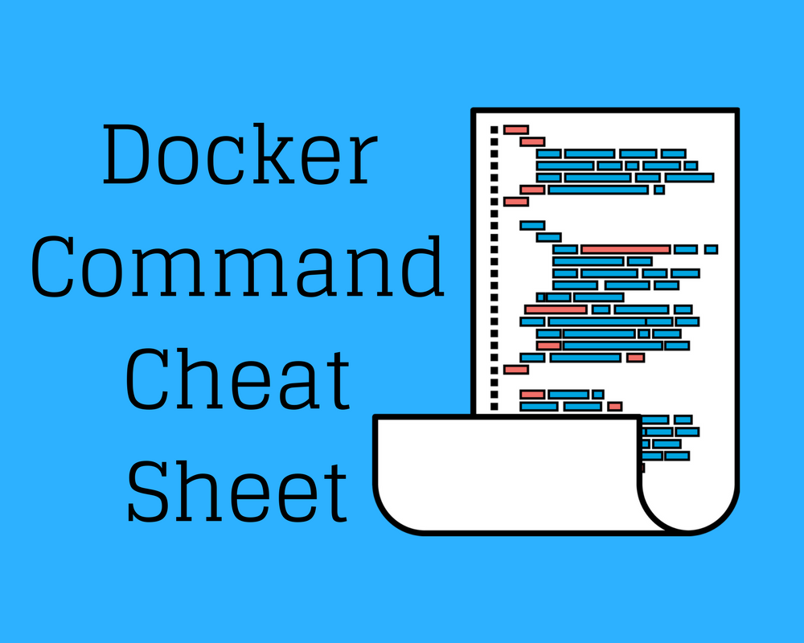

+++
title = "Docker Cheat Sheet"
subtitle = "This is my Docker commands sheat sheet."

date = "2020-12-02"
lastmod = "2020-12-16"

fragment = "content"
weight = 100
tags = ["docker", "cheat", "sheet"]
+++



# A list of docker commands

---

### List images

``` bash
docker images [OPTIONS] [REPOSITORY[:TAG]]
```

#### Options

| Name, shorthand | Default | Description                                         |
| :-------------- | :------:| --------------------------------------------------- |
| `--all , -a`    |         | Show all images (default hides intermediate images) |
| `--digests`     |         | Show digests                                        |
| `--filter , -f` |         | Filter output based on conditions provided          |
| `--format`      |         | Pretty-print images using a Go template             |
| `--no-trunc`    |         | Don’t truncate output                               |
| `--quiet , -q`  |         | Only show numeric IDs                               |

---

### Remove one or more containers

``` bash
docker rm [OPTIONS] CONTAINER [CONTAINER...]
```

#### Options

| Name, shorthand | Default | Description                                             |
|:----------------|:-------:| ------------------------------------------------------- |
|`--force , -f`   |         | Force the removal of a running container (uses SIGKILL) |
|`--link , -l`    |         | Remove the specified link                               |
|`--volumes , -v` |         | Remove anonymous volumes associated with the container  |

---

### Stop one or more running containers

``` Bash
docker stop [OPTIONS] CONTAINER [CONTAINER...]
```

#### Options

| Name, shorthand | Default | Description                                 |
|:----------------|:-------:| ------------------------------------------- |
|`--time , -t`    | 10      | Seconds to wait for stop before killing it. |
